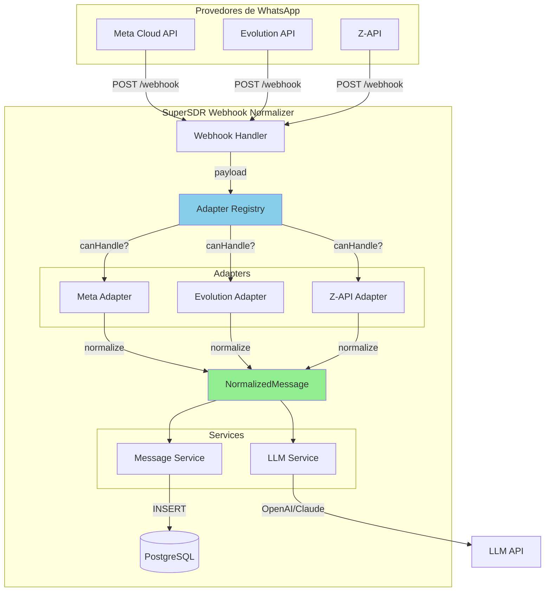
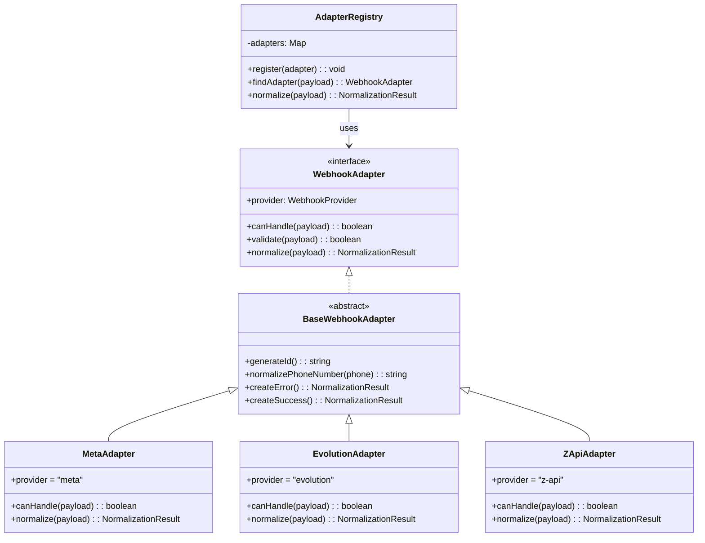
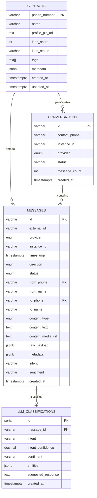
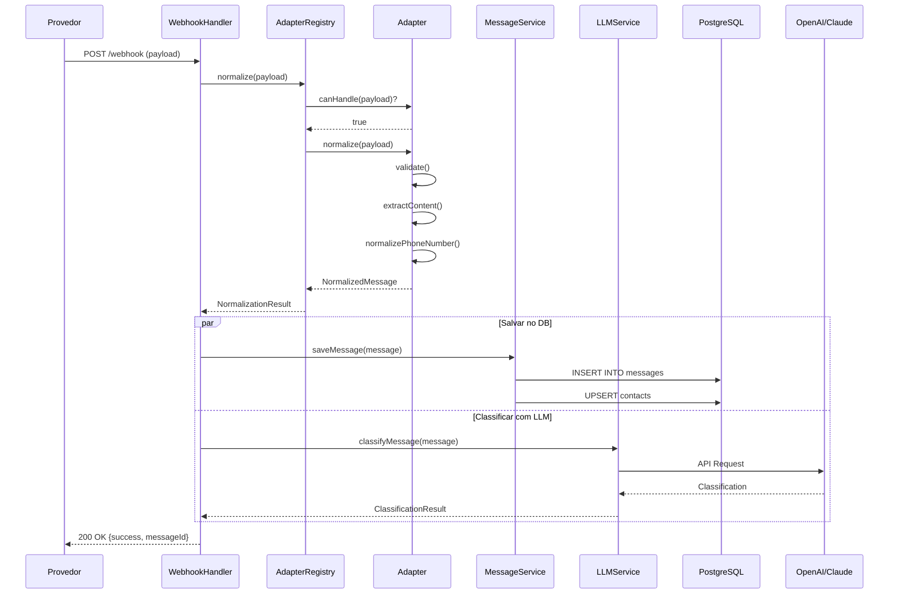

# Diagramas do Sistema

## Fluxo de Processamento de Webhook

```mermaid
flowchart TD
    subgraph Provedores ["Provedores de WhatsApp"]
        META[Meta Cloud API]
        EVO[Evolution API]
        ZAPI[Z-API]
    end

    subgraph Sistema ["SuperSDR Webhook Normalizer"]
        WH[Webhook Handler]
        AR[Adapter Registry]
        
        subgraph Adapters ["Adapters"]
            MA[Meta Adapter]
            EA[Evolution Adapter]
            ZA[Z-API Adapter]
        end
        
        NM[NormalizedMessage]
        
        subgraph Services ["Services"]
            MS[Message Service]
            LS[LLM Service]
        end
        
        DB[(PostgreSQL)]
    end

    META -->|POST /webhook| WH
    EVO -->|POST /webhook| WH
    ZAPI -->|POST /webhook| WH
    
    WH -->|payload| AR
    AR -->|canHandle?| MA
    AR -->|canHandle?| EA
    AR -->|canHandle?| ZA
    
    MA -->|normalize| NM
    EA -->|normalize| NM
    ZA -->|normalize| NM
    
    NM --> MS
    NM --> LS
    
    MS -->|INSERT| DB
    LS -->|OpenAI/Claude| LLM[LLM API]
    
    style NM fill:#90EE90
    style AR fill:#87CEEB
```

## Estrutura do Adapter Pattern

```mermaid
classDiagram
    class WebhookAdapter {
        <<interface>>
        +provider: WebhookProvider
        +canHandle(payload): boolean
        +validate(payload): boolean
        +normalize(payload): NormalizationResult
    }
    
    class BaseWebhookAdapter {
        <<abstract>>
        +generateId(): string
        +normalizePhoneNumber(phone): string
        +createError(): NormalizationResult
        +createSuccess(): NormalizationResult
    }
    
    class MetaAdapter {
        +provider = "meta"
        +canHandle(payload): boolean
        +normalize(payload): NormalizationResult
    }
    
    class EvolutionAdapter {
        +provider = "evolution"
        +canHandle(payload): boolean
        +normalize(payload): NormalizationResult
    }
    
    class ZApiAdapter {
        +provider = "z-api"
        +canHandle(payload): boolean
        +normalize(payload): NormalizationResult
    }
    
    class AdapterRegistry {
        -adapters: Map
        +register(adapter): void
        +findAdapter(payload): WebhookAdapter
        +normalize(payload): NormalizationResult
    }
    
    WebhookAdapter <|.. BaseWebhookAdapter
    BaseWebhookAdapter <|-- MetaAdapter
    BaseWebhookAdapter <|-- EvolutionAdapter
    BaseWebhookAdapter <|-- ZApiAdapter
    AdapterRegistry --> WebhookAdapter : uses
```

## Modelo de Dados

```mermaid
erDiagram
    CONTACTS {
        varchar phone_number PK
        varchar name
        text profile_pic_url
        int lead_score
        varchar lead_status
        text[] tags
        jsonb metadata
        timestamptz created_at
        timestamptz updated_at
    }
    
    MESSAGES {
        varchar id PK
        varchar external_id
        enum provider
        varchar instance_id
        timestamptz timestamp
        enum direction
        enum status
        varchar from_phone FK
        varchar from_name
        varchar to_phone FK
        varchar to_name
        enum content_type
        text content_text
        text content_media_url
        jsonb raw_payload
        jsonb metadata
        varchar intent
        varchar sentiment
        timestamptz created_at
    }
    
    CONVERSATIONS {
        varchar id PK
        varchar contact_phone FK
        varchar instance_id
        enum provider
        varchar status
        int message_count
        timestamptz created_at
    }
    
    LLM_CLASSIFICATIONS {
        serial id PK
        varchar message_id FK
        varchar intent
        decimal intent_confidence
        varchar sentiment
        jsonb entities
        text suggested_response
        timestamptz created_at
    }
    
    CONTACTS ||--o{ MESSAGES : "from/to"
    CONTACTS ||--o{ CONVERSATIONS : "participates"
    MESSAGES ||--o| LLM_CLASSIFICATIONS : "classified"
    CONVERSATIONS ||--o{ MESSAGES : "contains"
```

## Sequência de Processamento

```mermaid
sequenceDiagram
    participant P as Provedor
    participant WH as WebhookHandler
    participant AR as AdapterRegistry
    participant A as Adapter
    participant MS as MessageService
    participant LS as LLMService
    participant DB as PostgreSQL
    participant LLM as OpenAI/Claude

    P->>WH: POST /webhook (payload)
    WH->>AR: normalize(payload)
    AR->>A: canHandle(payload)?
    A-->>AR: true
    AR->>A: normalize(payload)
    A->>A: validate()
    A->>A: extractContent()
    A->>A: normalizePhoneNumber()
    A-->>AR: NormalizedMessage
    AR-->>WH: NormalizationResult
    
    par Salvar no DB
        WH->>MS: saveMessage(message)
        MS->>DB: INSERT INTO messages
        MS->>DB: UPSERT contacts
    and Classificar com LLM
        WH->>LS: classifyMessage(message)
        LS->>LLM: API Request
        LLM-->>LS: Classification
        LS-->>WH: ClassificationResult
    end
    
    WH-->>P: 200 OK {success, messageId}
```
